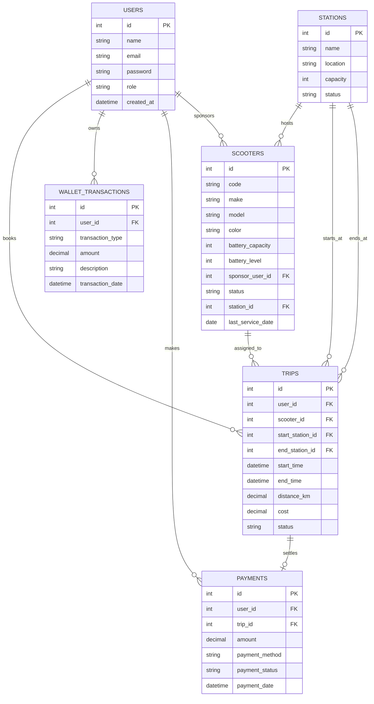

# CESC ERD

```mermaid
erDiagram
    USERS ||--o{ TRIPS : books
    USERS ||--o{ WALLET_TRANSACTIONS : owns
    USERS ||--o{ PAYMENTS : makes
    USERS ||--o{ SCOOTERS : sponsors
    STATIONS ||--o{ SCOOTERS : hosts
    STATIONS ||--o{ TRIPS : starts_at
    STATIONS ||--o{ TRIPS : ends_at
    SCOOTERS ||--o{ TRIPS : assigned_to
    TRIPS ||--o| PAYMENTS : settles

    USERS {
        int id PK
        string name
        string email
        string password
        string role
        datetime created_at
    }

    STATIONS {
        int id PK
        string name
        string location
        int capacity
        string status
    }

    SCOOTERS {
        int id PK
        string code
        string make
        string model
        string color
        int battery_capacity
        int battery_level
        int sponsor_user_id FK
        string status
        int station_id FK
        date last_service_date
    }

    TRIPS {
        int id PK
        int user_id FK
        int scooter_id FK
        int start_station_id FK
        int end_station_id FK
        datetime start_time
        datetime end_time
        decimal distance_km
        decimal cost
        string status
    }

    WALLET_TRANSACTIONS {
        int id PK
        int user_id FK
        string transaction_type
        decimal amount
        string description
        datetime transaction_date
    }

    PAYMENTS {
        int id PK
        int user_id FK
        int trip_id FK
        decimal amount
        string payment_method
        string payment_status
        datetime payment_date
    }
```
